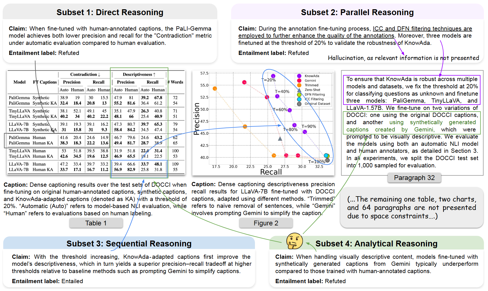

# SCIVER: A Benchmark for Multimodal Scientific Claim Verification

<p align="center">
  <a href="https://github.com/QDRhhhh/SciVer">🌐 Github</a> •
  <a href="https://arxiv.org/abs/2506.15569">📖 Paper</a> •
  <a href="https://huggingface.co/datasets/chengyewang/SciVer">🤗 Data</a>
</p>

## 📰 News
- [May 15, 2025] SciVer has been accepted by ACL 2025 Main!

## 👋 Overview



**SCIVER** is the first benchmark specifically designed to evaluate the ability of foundation models to verify scientific claims across **text**, **charts**, and **tables**. It challenges models to reason over complex, multimodal contexts with **fine-grained entailment labels** and **expert-annotated rationales**.

> 📌 “Can Multimodal Foundation Models Reason Over Scientific Claims with Text, Tables, and Charts?”

------

## 🌟 Highlights

- 🧪 **3,000 expert-annotated examples** from **1113 scientific papers**
- 🧠 Four core **reasoning subsets**:
  - Direct
  - Parallel
  - Sequential
  - Analytical
- 📚 Context includes **text paragraphs, multiple tables, and charts**
- 🔍 Labels: `Entailed`, `Refuted`
- 📈 Evaluated across **21 leading foundation models**, including o4-mini, GPT-4o, Claude 3.5, Qwen2.5-VL, LLaMA-3.2-Vision, etc.
- ⚖️ Includes **step-by-step rationale** and **automated accuracy evaluation**

------

## 🧩 Benchmark Structure

Each SCIVER sample includes:

- A **claim** grounded in multimodal scientific context
- **Contextual inputs**: text, tables (as images), charts (as images)
- A **gold entailment label** (entailed / refuted)
- **Supporting evidence** and a **reasoning rationale**

### 🧠 Subsets by Reasoning Type

1. **Direct Reasoning** – extract simple facts
2. **Parallel Reasoning** – synthesize info from multiple sources
3. **Sequential Reasoning** – perform step-by-step inference
4. **Analytical Reasoning** – apply domain expertise and logic

------

## 📊 Model Evaluation

We evaluate 21 models using Chain-of-Thought prompting.

| Model            | Accuracy  |
| ---------------- | --------- |
| 🧑‍🔬Human Expert   | **93.8%** |
| o4-mini (OpenAI) | 77.7%     |
| GPT-4o           | 70.9%     |
| Qwen2.5-VL-72B   | 69.4%     |
| InternVL3-38B    | 62.5%     |

> Text-only versions of models drop 35–53% in accuracy — showing **multimodal context is essential**.

------

## 🛠️ Quickstart

### 🔁 Step 0: Installation

```bash
git clone https://github.com/QDRhhhh/SciVer.git
cd SciVer
conda create --name sciver python=3.10
conda activate sciver
pip install -r requirements.txt
```

### 🔁 Step 1: Download Dataset from huggingface

```bash
git lfs install
git clone https://huggingface.co/datasets/chengyewang/SciVer
```

### 🔁 Step 2: Run Model Inference

```bash
bash scripts/vllm_large.sh
```

This will generate model responses and save them to:

```
./outputs/
```

### ✅ Step 3: Evaluate Model Accuracy

```bash
python acc_evaluation.py
```

The processed results and accuracy scores will be saved to:

```
./processed_outputs/
```

### Remote OpenAI-compatible API benchmarks

SciVer also provides an additive, provider-neutral remote benchmark path. It
supports the following model identifiers and datasets:

- Models: `Qwen2.5-VL-7B-Instruct`, `gemma-4-31B-it`,
  `gemma-4-26B-A4B-it`, and `gemma-3-27b-it`
- Datasets: `SciVer`, `SciAtomicBench`, `MuSciClaims`, and `SciClaimEval`

Create a local environment file before a live API run:

```bash
cp .env.example .env
```

Fill in `API_URL` with the compatible API endpoint and `API_KEY` with its
credential. Existing shell environment values take precedence over `.env`.
Only commands using `--live-api` require these values. Offline preparation,
dry-run, result evaluation, and tests do not load or require them.
`API_TIMEOUT_SECONDS` and `API_MAX_RETRIES` remain optional environment
settings and otherwise use the existing defaults.

The Meta-Harness proposer uses the local Codex CLI authentication state. Codex
does not require or receive the solver `API_KEY` or `API_URL`.
The proposer is fixed to `gpt-5.6-terra` with `medium` reasoning, while the
remote OpenAI-compatible search solver is fixed to `gemma-4-26B-A4B-it`.

Start with an offline dry-run. It validates and prepares one local sample but
does not read credentials, create an HTTP client, or write a result file:

```bash
python main.py \
  --provider remote \
  --dataset SciVer \
  --dataset-path /absolute/path/to/SciVer/testset.json \
  --model Qwen2.5-VL-7B-Instruct \
  --method cot \
  --max-num 1 \
  --dry-run
```

The four registered adapters accept their released local schemas directly and
convert them to one leakage-safe SciVer evaluation record. Non-SciVer samples
use `claim_type="analytical"`; SciAtomic Markdown tables are rendered to PNG.
To materialize normalized JSON explicitly, run:

```bash
python scripts/normalize_dataset.py \
  --dataset SciAtomicBench \
  --dataset-path /absolute/path/to/SciAtomicBench \
  --output outputs/normalized/sciatomic.json
```

The offline evaluator reports per-dataset Accuracy, confusion matrix, parse
coverage and failures, plus macro-average Accuracy across datasets.

Live access is always explicit and requires `--live-api`. See the
[remote benchmark guide](docs/remote-benchmark.md) for architecture, safe
credential setup, smoke/pilot/full/resume commands, result schema, evaluation,
retries, checkpoints, cost controls, and extension guidance.

### Full-Search v3 prompt search

The supported prompt-only experiment is `sciver_full_search_v3`. Use the
[canonical server notebook](notebooks/sciver_full_search_v3_server.ipynb) for
normal operation or the thin
[`run_full_search_v3_server.py`](scripts/run_full_search_v3_server.py) wrapper
for terminal operation. Both delegate preparation, isolated SMOKE receipt
validation, SEARCH, resume, freeze, paired FINAL, and sanitized status
reporting to the same repository interface.

The workflow keeps canonical `cot`, request construction, image order, parser,
metrics, and solver generation behavior fixed. It evaluates P0 and each prompt
candidate on the complete immutable SEARCH split, freezes the SEARCH-only
winner as additive `meta_cot`, and requires separate authorization for paired
FINAL. See the [server operations guide](docs/sciver_full_search_v3_server_operations.md)
and the [legacy removal note](docs/full_search_v3_migration.md).

------

## 🤝 Contributing

We welcome contributions for:

- 🧬 Domain extension (e.g., biology, medicine)
- 🔧 Additional model adapters
- 📈 New evaluation metrics and visualization tools

## ✍️ Citation

If you use our work and are inspired by our work, please consider cite us:

```
@inproceedings{wang-etal-2025-sciver,
  title     = {SciVer: Evaluating Foundation Models for Multimodal Scientific Claim Verification},
  author    = {Wang, Chengye and Shen, Yifei and Kuang, Zexi and Cohan, Arman and Zhao, Yilun},
  booktitle = {Proceedings of the 63rd Annual Meeting of the Association for Computational Linguistics (Volume 1: Long Papers)},
  year      = {2025},
  month     = jul,
  address   = {Vienna, Austria},
  publisher = {Association for Computational Linguistics},
  pages     = {8562--8579},
  url       = {https://aclanthology.org/2025.acl-long.420/}
}
```
